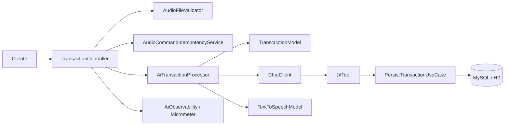
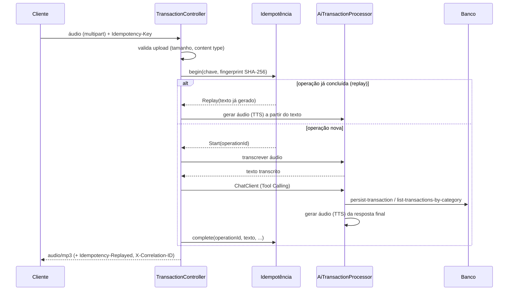

# Budgeting API com Spring Boot e Spring AI


## Visão geral

Este módulo é o projeto final da trilha [DIO Spring Boot Learning Track](../README.md) (módulo `05-spring-ai`): uma API REST de controle financeiro pessoal (cadastro e consulta de transações) que evoluiu, ao longo de 13 tarefas incrementais, de um desafio educacional simples para um exemplo completo de **integração de IA em uma arquitetura em camadas disciplinada**.

O diferencial é o endpoint `POST /transactions/ai`: o usuário grava um comando de voz ("gastei 50 reais no mercado"), a API transcreve o áudio, interpreta a intenção com um `ChatClient` (Tool Calling), persiste a transação usando os **mesmos casos de uso** do fluxo REST tradicional, e devolve uma resposta falada em áudio. Em torno desse fluxo foram construídas, tarefa a tarefa: validação de upload, tratamento de erros padronizado, resiliência a falhas do provedor de IA, idempotência persistente com expiração/limpeza automática, observabilidade (logs, métricas, correlação), configuração segura por ambiente, e uma auditoria final de segurança e qualidade.

**Importante**: este é um projeto educacional, não um sistema financeiro pronto para produção — não há autenticação/autorização, e diversas decisões (detalhadas na seção [Limitações](#limitações)) refletem escopo de aprendizado, não um produto real.

## Sumário

- [Funcionalidades](#funcionalidades)
- [Tecnologias](#tecnologias)
- [Arquitetura](#arquitetura)
- [Fluxo REST tradicional](#fluxo-rest-tradicional)
- [Fluxo com IA](#fluxo-com-ia)
- [Endpoints](#endpoints)
- [Exemplos de uso](#exemplos-de-uso)
- [Erros HTTP](#erros-http)
- [Upload de áudio](#upload-de-áudio)
- [Valores monetários](#valores-monetários)
- [Validações](#validações)
- [Tratamento de erros](#tratamento-de-erros)
- [Resiliência da integração com IA](#resiliência-da-integração-com-ia)
- [Idempotência do processamento por áudio](#idempotência-do-processamento-por-áudio)
- [Observabilidade](#observabilidade)
- [Segurança](#segurança)
- [Configuração por ambiente](#configuração-por-ambiente)
- [Banco de dados](#banco-de-dados)
- [Como executar](#como-executar)
- [Swagger e Actuator](#swagger-e-actuator)
- [Testes automatizados](#testes-automatizados)
- [Estrutura do projeto](#estrutura-do-projeto)
- [Decisões técnicas](#decisões-técnicas)
- [Limitações](#limitações)
- [Melhorias futuras](#melhorias-futuras)
- [Contexto educacional](#contexto-educacional)
- [Referências de arquitetura compartilhada](#referências-de-arquitetura-compartilhada)

## Funcionalidades

- Cadastro de transações financeiras via REST (`POST /transactions`).
- Consulta de transações por categoria (`GET /transactions/{category}`).
- Registro de transações por comando de voz (`POST /transactions/ai`): transcrição, interpretação via `ChatClient`/Tool Calling, persistência e resposta falada.
- Idempotência persistente por chave de cliente, com replay seguro, expiração e limpeza automática.
- Retry controlado e classificação de falhas da integração com a OpenAI (timeout, indisponibilidade, resposta inválida).
- Tratamento global de erros com contrato único (`ProblemDetail`, RFC 9457).
- Observabilidade: correlação por requisição (`X-Correlation-ID`), métricas técnicas (Micrometer) e logs estruturados.
- Configuração segura, separada por ambiente (`dev`/`test`/`prod`), sem segredo versionado.
- Documentação interativa via Swagger/OpenAPI.
- Suíte de testes automatizados (unitários, MVC, JPA/H2, configuração, segurança, métricas) — nenhum depende de MySQL, Docker ou de uma chamada real à OpenAI.

## Tecnologias

- Java 25
- Spring Boot 4.0.5
- Spring AI 2.0.0-M4 (`ChatClient`, `TranscriptionModel`, `TextToSpeechModel`, Tool Calling)
- Spring MVC
- Spring Data JPA
- MySQL (desenvolvimento) / H2 (testes)
- Gradle (Gradle Wrapper)
- springdoc-openapi (Swagger UI / OpenAPI 3)
- Micrometer + Spring Boot Actuator
- JUnit 5, Mockito, MockMvc, AssertJ

## Arquitetura

O módulo segue a mesma arquitetura em camadas usada no restante da trilha (ver [DDD Layered Architecture](../README.md#ddd-layered-architecture)), com a integração de IA e as preocupações técnicas (idempotência, observabilidade) isoladas em `infrastructure`, sem vazar para `domain`/`application`:



- **`domain`**: `Transaction`, `Category`, `TransactionId`, `InvalidTransactionException` — sem dependência de Spring, HTTP, JPA ou Micrometer.
- **`application`**: `PersistTransactionUseCase`, `ListTransactionsByCategoryUseCase` — usados tanto pelo REST tradicional quanto como `@Tool` do Tool Calling (mesma regra de negócio nos dois fluxos).
- **`infrastructure.http`**: controller, filtro de correlação, validação de upload, tratamento global de erros.
- **`infrastructure.ai`**: integração com os três modelos da OpenAI e classificação de falhas.
- **`infrastructure.idempotency`**: chave idempotente, expiração, limpeza agendada.
- **`infrastructure.observability`**: métricas Micrometer centralizadas.
- **`infrastructure.persistence`**: adaptadores JPA.
- **`infrastructure.config`**: Swagger/OpenAPI e validação de variáveis de ambiente obrigatórias.

## Fluxo REST tradicional

**`POST /transactions`** — cadastra uma transação a partir de um payload JSON, sem áudio nem IA:

1. Bean Validation (`@NotBlank`, `@DecimalMin` etc.) rejeita payloads obviamente inválidos com `400`.
2. `PersistTransactionUseCase` reconstrói um `Transaction` de domínio, que valida novamente (fonte de verdade — ver [Validações](#validações)).
3. A transação é persistida via `JpaTransactionRepository`.
4. Resposta `201 Created` com o `TransactionResponse` (id, categoria, descrição, valor).

**`GET /transactions/{category}`** — lista transações de uma categoria:

1. `category` é validado contra o enum `Category` (`GROCERIES`, `PHARMA`, `AUTO`); um valor fora do enum retorna `400`.
2. `ListTransactionsByCategoryUseCase` consulta o repositório.
3. Resposta `200 OK` com uma lista (vazia se não houver registros).

## Fluxo com IA

**`POST /transactions/ai`** — registra uma transação por comando de voz:



Passo a passo:

1. **Validação do upload** — tamanho e `content type` (ver [Upload de áudio](#upload-de-áudio)); um arquivo inválido nunca gera custo.
2. **Validação da chave idempotente** — header `Idempotency-Key` obrigatório, formato restrito.
3. **Fingerprint** — SHA-256 do conteúdo do áudio, usado para detectar reenvio do mesmo comando com o mesmo arquivo (nunca exposto em respostas ou logs).
4. **Transcrição** — `TranscriptionModel` (whisper-1) converte áudio em texto.
5. **ChatClient** — o texto é enviado ao modelo (gpt-4o-mini) com as tools disponíveis.
6. **Tool Calling** — o modelo aciona `persist-transaction` ou `list-transactions-by-category`, que executam os **mesmos use cases** do fluxo REST.
7. **Persistência** — ocorre dentro da tool, uma única vez por chamada.
8. **TTS** — a resposta final do `ChatClient` é convertida em áudio (gpt-4o-mini-tts).
9. **Resposta** — `audio/mp3`, com os headers `Idempotency-Replayed` (`true`/`false`) e `Cache-Control: no-store`.

Se a chave já foi usada e a operação está concluída, os passos 4–7 são pulados e apenas o TTS roda novamente sobre o texto já gerado (replay).

## Endpoints

| Método | Endpoint | Descrição | Resposta de sucesso |
| ------ | -------- | --------- | -------------------- |
| `POST` | `/transactions` | Cadastra uma transação a partir de JSON | `201 Created` + `TransactionResponse` |
| `GET` | `/transactions/{category}` | Lista transações de uma categoria (`GROCERIES`, `PHARMA`, `AUTO`) | `200 OK` + lista de `TransactionResponse` |
| `POST` | `/transactions/ai` | Registra uma transação por comando de voz | `200 OK` + `audio/mp3` |

Headers de `POST /transactions/ai`:

| Header | Direção | Obrigatório | Descrição |
| ------ | ------- | ----------: | --------- |
| `Idempotency-Key` | Requisição | Sim | Chave opaca do cliente, até 128 caracteres, `[A-Za-z0-9._:-]` |
| `X-Correlation-ID` | Requisição | Não | Identificador de correlação opcional (gerado se ausente/inválido) |
| `Idempotency-Replayed` | Resposta | — | `true` se a resposta veio de replay, `false` se processada agora |
| `X-Correlation-ID` | Resposta | — | Sempre devolvido, em sucesso ou erro |
| `Cache-Control` | Resposta | — | `no-store` — a resposta de áudio nunca deve ser cacheada |

## Exemplos de uso

**Criar transação manual**:

```bash
curl -X POST \
  http://localhost:8080/transactions \
  -H "Content-Type: application/json" \
  -d '{"description": "Almoço", "amount": 42.90, "category": "GROCERIES"}'
```

**Consultar transações por categoria**:

```bash
curl http://localhost:8080/transactions/GROCERIES
```

**Processar um comando de voz**:

```bash
curl -X POST \
  http://localhost:8080/transactions/ai \
  -H "Idempotency-Key: comando-001" \
  -H "X-Correlation-ID: teste-local-001" \
  -F "file=@comando.m4a;type=audio/mp4" \
  --output resposta.mp3
```

Nenhum exemplo acima requer ou expõe uma API key — a chave da OpenAI é configurada apenas no servidor, via variável de ambiente (ver [Variáveis de ambiente](#variáveis-de-ambiente)).

## Erros HTTP

| Status | Situação |
| -----: | -------- |
| 400 | Payload/JSON inválido, categoria inexistente, chave idempotente ausente/inválida, upload ausente/vazio/tipo não permitido |
| 404 | Rota inexistente |
| 409 | Conflito de idempotência: mesmo chave com arquivo diferente, operação em processamento, ou retry inseguro bloqueado |
| 413 | Arquivo de áudio acima do limite (10 MB por padrão) |
| 422 | Áudio sem conteúdo de fala identificável na transcrição |
| 500 | Erro inesperado, ou falha de configuração/credencial da OpenAI (nunca exposta ao cliente) |
| 502 | Resposta vazia/inválida do ChatClient ou TTS, ou falha não classificada da integração |
| 503 | Provedor de IA indisponível ou limite de requisições atingido (429 do provedor nunca vira 429 desta API) |
| 504 | Timeout na chamada ao provedor de IA |

Todas seguem o contrato `ProblemDetail` (RFC 9457): `type`, `title`, `status`, `detail`, `instance`, `timestamp`, e `errors` (lista de `{field, message}`) quando há falha de validação de campo. Stack traces e mensagens técnicas internas nunca aparecem no corpo da resposta.

## Upload de áudio

`POST /transactions/ai` recebe o comando de voz como `multipart/form-data`, na parte obrigatória `file`.

Antes de qualquer chamada à OpenAI (transcrição, ChatClient, geração de voz), o arquivo é validado localmente por `AudioFileValidator`:

1. arquivo presente e não vazio;
2. tamanho dentro do limite (`app.audio.max-size`, padrão **10 MB**, sobrescrevível por `AUDIO_MAX_SIZE`);
3. `content type` presente;
4. `content type` entre os aceitos: `audio/mpeg`, `audio/mp3`, `audio/mp4`, `audio/m4a`, `audio/x-m4a`, `audio/wav`, `audio/x-wav`, `audio/webm`.

Um arquivo que falhe em qualquer uma dessas regras é rejeitado **sem gerar custo**: nenhuma chamada a `TranscriptionModel`, `ChatClient` ou `TextToSpeechModel` ocorre para um upload inválido.

**Atenção**: esta validação verifica apenas o `content type` declarado pelo cliente, não o conteúdo binário do arquivo — um arquivo renomeado (ex.: `.exe` enviado como `audio/mpeg`) não é detectado. O nome do arquivo nunca é usado para operações de sistema de arquivos (sem risco de path traversal). Uploads que passam na validação ainda geram chamadas reais e potencialmente pagas à API da OpenAI.

## Valores monetários

- `amount` é representado como `BigDecimal`, em **reais**, sempre normalizado para **duas casas decimais** (`RoundingMode.HALF_UP`), do domínio (`Transaction`) até a persistência (`DECIMAL(19,2)`) e as respostas REST/Tool Calling.
- Exemplo: `{"description": "Combustível", "amount": 80.90, "category": "AUTO"}` → resposta `{"id": "...", "category": "AUTO", "description": "Combustível", "amount": 80.90}`.
- Valores são arredondados, não truncados, quando têm mais de duas casas (ex.: `80.905` vira `80.91`).
- **Nota sobre banco local**: se um MySQL local já estava rodando com uma coluna `BIGINT` antiga, o schema não é migrado automaticamente de forma segura (`ddl-auto=update` não converte `BIGINT` para `DECIMAL`). Recrie o banco de desenvolvimento local (ou execute `ALTER TABLE` manualmente) antes de rodar contra um schema pré-existente.

## Validações

As invariantes de negócio são aplicadas centralmente no domínio (`Transaction`), então tanto o REST quanto o Tool Calling passam pela mesma proteção — as regras não dependem apenas de anotações do controller/DTO:

- **Descrição**: obrigatória, não pode ser nula/vazia/em branco; espaços nas pontas são removidos.
- **Valor**: obrigatório, deve ser maior que zero **após** normalização para duas casas (`HALF_UP`) — ex.: `0.004` arredonda para `0.00` e é rejeitado, enquanto `0.005` arredonda para `0.01` e é aceito.
- **Categoria**: obrigatória, restrita aos valores atuais do enum (`GROCERIES`, `PHARMA`, `AUTO`).

Entrada inválida lança `InvalidTransactionException` (exceção de domínio, sem conceito de HTTP) antes de qualquer chamada ao repositório. Anotações de Bean Validation (`@NotBlank`, `@NotNull`, `@DecimalMin`) foram adicionadas a `TransactionRequest` como uma primeira barreira HTTP — mas essa é uma camada de conveniência, não a fonte da verdade.

## Tratamento de erros

Todos os endpoints REST retornam erros em um contrato único e previsível, baseado no padrão nativo do Spring (`ProblemDetail`, RFC 9457), implementado por um `@RestControllerAdvice` (`GlobalExceptionHandler`). A exceção de domínio (`InvalidTransactionException`) não conhece HTTP: quem traduz negócio em status code é sempre o handler global.

- Erros de validação retornam a lista completa de campos inválidos, ordenada por nome do campo.
- Categoria inválida (no corpo ou na rota) indica os valores aceitos na mensagem.
- JSON malformado retorna `400` com mensagem genérica e segura — sem nomes de classes internas, caminhos ou detalhes do Jackson.
- Rotas inexistentes retornam `404` (ex.: `/actuator/env`, quando não exposto).
- Falhas inesperadas retornam `500` com mensagem genérica; o erro completo é registrado no servidor via SLF4J, nunca exposto ao cliente.

## Resiliência da integração com IA

`POST /transactions/ai` encadeia três chamadas externas — transcrição, `ChatClient` (com Tool Calling) e geração de voz — cada uma classificada e traduzida para um `ProblemDetail` padronizado, via `AiIntegrationException` lançada por `AiTransactionProcessor`.

| Etapa | Motivo | Status |
| --- | --- | -----: |
| Transcrição | áudio sem fala identificável | 422 |
| Qualquer etapa | timeout de conexão/leitura | 504 |
| Qualquer etapa | limite de requisições do provedor (HTTP 429) | 503 |
| Qualquer etapa | provedor indisponível (HTTP 5xx, conexão recusada) | 503 |
| Chat / TTS | resposta vazia ou estruturalmente inválida | 502 |
| Qualquer etapa | falha externa não classificada | 502 |
| Qualquer etapa | credencial/configuração inválida (HTTP 401/403) | 500 |

Um HTTP 429 do provedor **nunca** vira `429` na resposta desta API — o limite é da conta OpenAI, não da API local.

- **Timeout**: `spring.http.clients.connect-timeout`/`read-timeout` (10s/60s por padrão, `AI_CONNECT_TIMEOUT`/`AI_READ_TIMEOUT`) — configuração global, compartilhada pelos três modelos.
- **Retry**: `spring-ai-retry` retenta automaticamente falhas transitórias (5xx, timeout/conexão) via um `RetryTemplate` compartilhado. Isso **não duplica Tool Calling**: o retry atua só na chamada HTTP; a execução do `@Tool` é um método Java local, disparado uma única vez por `tool_call`. Tentativas limitadas a `spring.ai.retry.max-attempts=2` (`AI_RETRY_MAX_ATTEMPTS`). HTTP 4xx nunca é retentado automaticamente.
- **Tool Calling e domínio**: uma exceção de domínio lançada pelas tools (`InvalidTransactionException`) é convertida em texto e devolvida ao modelo como resultado da tool — nunca propaga como exceção Java. Um comando inválido (ex.: valor zero) vira uma resposta em áudio explicando o problema, não um erro de integração.
- **Risco residual sem idempotência**: se o Tool Calling já persistiu a transação e a geração de voz falhar depois, a API retorna um erro (502/503/504) mesmo com a transação salva — mitigado (não eliminado) pela idempotência, ver seção abaixo.

## Idempotência do processamento por áudio

`POST /transactions/ai` pode ser chamado mais de uma vez para o **mesmo comando de voz** (clique duplo, timeout percebido pelo cliente, queda de conexão, retry manual). O header `Idempotency-Key` (string opaca do cliente, até 128 caracteres, `[A-Za-z0-9._:-]`) evita repetir transcrição/Tool Calling/persistência.

| Cenário | Comportamento |
| ------- | ------------- |
| Header ausente | `400` "Chave idempotente ausente" |
| Formato inválido | `400` "Chave idempotente inválida" |
| Mesma chave, mesmo arquivo, operação concluída | Replay: novo TTS a partir do texto já gerado, `Idempotency-Replayed: true` |
| Mesma chave, arquivo diferente | `409` "Chave idempotente em conflito" |
| Mesma chave, operação ainda em processamento | `409` "Operação em processamento" |
| Falha anterior na transcrição | Retry permitido com a mesma chave |
| Falha anterior no chat/TTS | `409` "Reprocessamento não permitido" — chave bloqueada, use uma nova |
| Chave expirada e removida | Tratada como operação nova (ver expiração abaixo) |

**Aviso importante**: a garantia idempotente é limitada à janela de retenção configurada. Após a expiração e remoção do registro, a mesma chave pode ser tratada como uma nova operação.

**Concorrência**: a proteção real é uma constraint única de banco em `idempotency_key` (não uma checagem em memória). O SHA-256 do conteúdo do áudio (fingerprint) nunca é exposto em respostas ou logs. O áudio (enviado ou gerado) nunca é armazenado.

### Expiração e limpeza

| Estado | Janela (padrão) | Ação após expiração |
| ------ | ---------------- | -------------------- |
| `COMPLETED` | 24h (`IDEMPOTENCY_COMPLETED_RETENTION`) | Removida; a chave pode iniciar uma nova operação |
| `FAILED` (qualquer estágio) | 24h (`IDEMPOTENCY_FAILED_RETENTION`) | Removida; a chave pode iniciar uma nova operação |
| `PROCESSING` | 15 min de inatividade (`IDEMPOTENCY_PROCESSING_TIMEOUT`) | Considerada abandonada e recuperada (nunca reprocessada automaticamente) |

Operações `PROCESSING` abandonadas (ex.: a aplicação caiu no meio do processamento) são recuperadas com base no estágio alcançado (`currentStage`): se Tool Calling ainda não rodou (`REGISTERED`/`TRANSCRIPTION`), a chave permite retry; se pode já ter rodado (`CHAT`/`SPEECH`, ou estágio desconhecido), o retry continua bloqueado. Essa recuperação acontece tanto oportunisticamente (dentro do próprio `begin()`, sem esperar o scheduler) quanto periodicamente (`IdempotencyCleanupScheduler`, `@Scheduled`, gated por `IDEMPOTENCY_CLEANUP_ENABLED`).

Concorrência entre scheduler e requisição é resolvida por lock otimista (`@Version`); entre limpeza e replay, pela releitura do `responseText` antes de qualquer exclusão, e por uma exclusão em lote que revalida `status`+`updatedAt` no momento do delete.

## Observabilidade

Correlação, logs estruturados e métricas técnicas — puramente aditivo: nada aqui influencia o resultado de uma requisição.

- **`X-Correlation-ID`**: opcional na requisição (reaproveitado se seguro; UUID gerado caso contrário), sempre devolvido na resposta (sucesso ou erro), disponível no MDC (`correlationId`) durante toda a requisição, sempre limpo no `finally`.

| Métrica | Finalidade |
| ------- | ---------- |
| `budgeting.ai.requests` | Duração total do endpoint (Timer; inclui replay) |
| `budgeting.ai.stage.duration` | Duração de transcrição/chat/TTS (Timer) |
| `budgeting.ai.failures` | Falhas por etapa e motivo classificado (Counter) |
| `budgeting.ai.upload.rejections` | Arquivos rejeitados antes de qualquer chamada à OpenAI (Counter) |
| `budgeting.ai.idempotency.operations` | Operações iniciadas (Counter) |
| `budgeting.ai.idempotency.replays` | Replays idempotentes (Counter) |
| `budgeting.ai.idempotency.conflicts` | Conflitos de idempotência (Counter) |
| `budgeting.idempotency.cleanup` | Operações recuperadas/removidas pelo scheduler (Counter) |

**Nunca registrados** em logs ou métricas: áudio, bytes do arquivo, transcrição, prompt, resposta completa da IA, `Idempotency-Key`, fingerprint, API key, senha. Todas as tags de métrica vêm de enums fechados ou literais fixos — nunca correlation ID, chave, fingerprint, nome de arquivo, mensagem de exceção ou URI dinâmica. O stack trace de uma falha de IA é logado exatamente uma vez (na camada que classifica).

## Segurança

- **Segredos apenas por variável de ambiente** — nenhuma chave, senha ou token versionado (ver [Configuração por ambiente](#configuração-por-ambiente)).
- **Upload limitado e validado** antes de qualquer custo com a OpenAI.
- **Validações centralizadas** no domínio, não apenas em anotações HTTP.
- **Respostas de erro seguras**: `ProblemDetail` padronizado, sem stack trace, sem mensagem técnica interna.
- **`Cache-Control: no-store`** na resposta de áudio de `/transactions/ai` — evita retenção por proxies/caches intermediários de uma resposta financeira/pessoal.
- **Actuator restrito**: apenas `health` (sem detalhes) e `metrics` expostos fora de produção; só `health` em produção. `env`, `beans`, `configprops`, `heapdump` nunca expostos.
- **Swagger desabilitado** no exemplo de configuração de produção.
- **Nenhum segredo em log** — verificado estaticamente por `VersionedSecretsTest`.

**Limitações de segurança** (ver também [Limitações](#limitações)): sem autenticação, sem autorização, sem proteção completa contra prompt injection na transcrição — este é um projeto educacional, não deve ser exposto publicamente sem essas camadas.

## Configuração por ambiente

Configuração organizada por ambiente para que nenhum segredo seja versionado e cada ambiente falhe de forma previsível.

| Arquivo | Carregado quando |
| --- | --- |
| `application.properties` | Sempre (base comum — sem chave OpenAI, sem datasource, sem perfil ativo) |
| `application-dev.properties` | `SPRING_PROFILES_ACTIVE=dev` |
| `application-prod.properties.example` | **Nunca automaticamente** (extensão `.example`) |
| `application-test.properties` | Perfil `test` (usado pela suíte de testes) |
| `.env.example` | **Nunca automaticamente** (não há suporte a dotenv) |

| Configuração | Dev | Test | Prod (`.example`) |
| --- | --- | --- | --- |
| Datasource | MySQL (`DB_URL`/`DB_USERNAME` com default local; `DB_PASSWORD` obrigatório) | H2 em memória | MySQL (tudo obrigatório, sem default) |
| `ddl-auto` | `update` | `create-drop` | `validate` |
| OpenAI key | obrigatória (`OPENAI_API_KEY`) | fictícia | obrigatória |
| Swagger | habilitado | habilitado | **desabilitado** |
| Actuator metrics | ligado | ligado | **desligado** |
| Scheduler de limpeza | ligado | **desligado** | ligado |

`application-prod.properties.example` **não é carregado automaticamente** — é documentação. Para produção, provisione `DB_URL`/`DB_USERNAME`/`DB_PASSWORD`/`OPENAI_API_KEY` como variáveis de ambiente reais (secret manager, CI/CD etc. — fora do escopo aqui) e replique as propriedades do `.example` onde sua aplicação realmente lê `application-prod.properties`; nunca copie o arquivo com um segredo dentro dele para o controle de versão. `EnvironmentConfigurationValidator` falha o startup com mensagem clara se qualquer uma das quatro variáveis estiver ausente em `dev`/`prod`.

### Variáveis de ambiente

| Variável | Obrigatória | Perfil | Descrição |
| --- | ---: | --- | --- |
| `SPRING_PROFILES_ACTIVE` | Não | Todos | Seleciona `dev`/`prod`; vazio = só configuração comum |
| `DB_URL` | Sim* | `dev`, `prod` | URL JDBC do MySQL (*`dev` tem default local) |
| `DB_USERNAME` | Sim* | `dev`, `prod` | Usuário do MySQL (*`dev` tem default `root`) |
| `DB_PASSWORD` | Sim | `dev`, `prod` | Senha do MySQL — sem default |
| `OPENAI_API_KEY` | Sim | `dev`, `prod` | Chave da API OpenAI — sem default |
| `AUDIO_MAX_SIZE` | Não | Todos | Limite de upload (padrão `10MB`) |
| `AI_CONNECT_TIMEOUT` / `AI_READ_TIMEOUT` | Não | Todos | Timeouts HTTP para OpenAI (padrão `10s`/`60s`) |
| `AI_RETRY_MAX_ATTEMPTS` | Não | Todos | Tentativas do `spring-ai-retry` (padrão `2`) |
| `IDEMPOTENCY_COMPLETED_RETENTION` / `IDEMPOTENCY_FAILED_RETENTION` / `IDEMPOTENCY_PROCESSING_TIMEOUT` / `IDEMPOTENCY_CLEANUP_ENABLED` | Não | Todos | Overrides da política de idempotência |

Nenhum valor real aparece acima — todos são nomes de variável ou exemplos ilustrativos.

## Banco de dados

- **`dev`**: MySQL, via `DB_URL`/`DB_USERNAME`/`DB_PASSWORD`, `ddl-auto=update` (conveniente para iterar localmente, mas pode aplicar mudanças destrutivas silenciosamente — não é migração versionada).
- **`test`**: H2 em memória, `MODE=MySQL`, `ddl-auto=create-drop` (schema recriado a cada execução). H2 em modo de compatibilidade MySQL não é equivalente total ao MySQL real (tipos, funções e comportamento de constraint podem divergir sutilmente).
- **`prod.example`**: MySQL, `ddl-auto=validate` (só detecta divergência de schema, não corrige).
- O projeto **não usa Flyway/Liquibase** — não há migração versionada; `ddl-auto` não substitui isso.
- `compose.yml` sobe um MySQL local via Docker (credenciais triviais de desenvolvimento, já versionadas) com porta `3307` e banco `transaction`; isso é independente do perfil `dev` (que usa por padrão porta `3306`/banco `budgeting`) — não combine os dois sem ajustar as variáveis, veja [Como executar](#como-executar).

## Como executar

**Pré-requisitos**: Java 25, Gradle Wrapper (incluso), um MySQL acessível (via `compose.yml` ou instância própria) e uma API key da OpenAI para o fluxo de IA.

Rodar os testes (nenhum profile, nenhuma chamada à OpenAI, sem MySQL/Docker):

```bash
./gradlew test
```

Rodar a aplicação com MySQL/OpenAI reais, perfil `dev`:

```powershell
$env:SPRING_PROFILES_ACTIVE="dev"
$env:DB_URL="jdbc:mysql://localhost:3306/budgeting"
$env:DB_USERNAME="root"
$env:DB_PASSWORD="sua-senha"
$env:OPENAI_API_KEY="sua-chave"

.\gradlew.bat bootRun
```

```bash
export SPRING_PROFILES_ACTIVE=dev
export DB_URL=jdbc:mysql://localhost:3306/budgeting
export DB_USERNAME=root
export DB_PASSWORD='sua-senha'
export OPENAI_API_KEY='sua-chave'

./gradlew bootRun
```

Nenhum dos valores acima é real — substitua pelos seus.

**Windows**: o caminho deste repositório contém `&`, o que quebra o tratamento interno de argumentos do `gradlew.bat`. Se `.\gradlew.bat ...` falhar com um erro de "comando não reconhecido", invoque o wrapper diretamente:

```powershell
java -jar gradle\wrapper\gradle-wrapper.jar test
java -jar gradle\wrapper\gradle-wrapper.jar bootRun
```

**Via Docker Compose** (mais simples, sem precisar de `SPRING_PROFILES_ACTIVE`): o `spring-boot-docker-compose` detecta `compose.yml` e conecta automaticamente ao MySQL do container. Basta configurar `OPENAI_API_KEY` e rodar `./gradlew bootRun` — nenhuma outra variável é necessária (não ative `dev` nesse caso, ver [Banco de dados](#banco-de-dados) sobre a divergência de porta/nome do banco).

## Swagger e Actuator

| URL | Descrição | Disponível em |
| --- | --------- | -------------- |
| `/swagger-ui/index.html` | Swagger UI (documentação interativa) | `dev`, `test`, comum — **desabilitado no exemplo de produção** |
| `/v3/api-docs` | JSON OpenAPI | mesma disponibilidade acima |
| `/actuator/health` | Status da aplicação (sem detalhes) | Sempre |
| `/actuator/metrics` | Métricas Micrometer | `dev`, `test`, comum — **desabilitado no exemplo de produção** |

Iniciar a aplicação sozinha **não** chama a OpenAI — as chamadas só ocorrem quando `/transactions/ai` é invocado. Cada chamada a esse endpoint realiza 3 chamadas reais e potencialmente pagas à API da OpenAI; não dispare pelo Swagger UI apenas para "testar a interface".

## Testes automatizados

```powershell
.\gradlew.bat test
```

Alternativa (ver nota sobre o `&` no caminho, acima):

```powershell
java -jar gradle\wrapper\gradle-wrapper.jar test
```

**Resultado atual** (última execução completa, TASK-013):

```text
292 testes executados
0 falhas
0 erros
5 pulados
```

Este número reflete a contagem de testes executados nesta versão do projeto, **não uma métrica de cobertura de código**.

Categorias: unitários (domínio, casos de uso, validadores), MVC com contrato mockado, integração real com JPA/H2, configuração por ambiente, segurança de configuração, métricas (`SimpleMeterRegistry`), idempotência e concorrência (lock otimista), e 5 classes externas puladas por padrão.

### Testes externos (`*IT`)

As 5 classes `OpenAiChatClientIT`, `OpenAiChatModelIT`, `OpenAiSpeechModelIT`, `OpenAiTranscriptionModelIT` e `ToolCallingIT` fazem chamadas **reais** à API da OpenAI. Todas são condicionadas por `@EnabledIfEnvironmentVariable(named = "OPENAI_API_KEY", matches = ".+")` — sem a variável definida, a classe inteira é pulada antes de qualquer teste rodar, então `./gradlew test` nunca as dispara acidentalmente. Só execute-as manualmente, com uma chave real seguramente configurada no seu ambiente (nunca em CI sem um cofre de segredos), ciente de que cada execução gera custo real.

## Estrutura do projeto

```text
src/main/java/dio/budgeting
├── application
│   ├── PersistTransactionUseCase.java
│   ├── ListTransactionsByCategoryUseCase.java
│   ├── input/
│   └── output/
├── domain
│   ├── Transaction.java
│   ├── Category.java
│   ├── TransactionId.java
│   └── TransactionRepository.java
└── infrastructure
    ├── ai/              # AiTransactionProcessor, classificação de falhas
    ├── config/          # OpenApiConfig, EnvironmentConfigurationValidator
    ├── http/            # TransactionController, CorrelationIdFilter, GlobalExceptionHandler
    │   └── audio/       # AudioFileValidator
    ├── idempotency/      # AudioCommandIdempotencyService, expiração, scheduler
    ├── observability/    # AiObservability (Micrometer)
    └── persistence/      # adaptadores JPA
```

## Decisões técnicas

- **`BigDecimal` para dinheiro**: nunca `double`/`float`, evitando erro de arredondamento binário em valores financeiros.
- **`ProblemDetail` (RFC 9457)** como contrato único de erro: padrão nativo do Spring, evita formatos ad hoc por endpoint.
- **Idempotência por chave opaca do cliente** (não gerada pelo servidor): o cliente decide o que conta como "o mesmo comando", igual ao padrão usado por APIs de pagamento.
- **SHA-256 do payload como complemento à chave**, não substituto: detecta reuso indevido da mesma chave para um comando diferente.
- **Replay via TTS apenas**: reconstruir só o áudio a partir do texto já gerado evita repetir Tool Calling (e uma possível persistência duplicada) sem precisar guardar o áudio original.
- **Transações JPA curtas**: nenhuma chamada à OpenAI acontece dentro de uma transação de banco — as chamadas de rede (potencialmente lentas) ficam sempre fora do escopo transacional.
- **Sem retry adicional no `ChatClient`**: o retry nativo do Spring AI já cobre falhas transitórias na camada HTTP; um retry customizado arriscaria duplicar Tool Calling.
- **Sem circuit breaker**: escopo educacional — o retry limitado e a classificação de erros já cobrem o cenário mais comum (falha transitória do provedor).
- **Sem tabela extra de auditoria**: logs estruturados + métricas + o próprio registro de idempotência já dão visibilidade suficiente para os objetivos desta trilha.
- **`Clock` injetável** em vez de `Instant.now()`/`OffsetDateTime.now()` espalhado: permite testes determinísticos de expiração sem `Thread.sleep`.
- **Actuator restrito por padrão**: sem autenticação em frente ao Actuator, expor o mínimo necessário (`health`, e `metrics` fora de produção) é a postura mais segura disponível sem introduzir um pacote de segurança completo.
- **Configuração por perfis explícitos** (`dev`/`test`/`prod`), nunca um perfil ativo hardcoded: cada ambiente falha de forma previsível em vez de herdar silenciosamente um default de outro.

## Limitações

- **Sem autenticação/autorização** — qualquer cliente com acesso à rede pode chamar os endpoints.
- **Sem Flyway/Liquibase** — sem migração de schema versionada; `ddl-auto` não substitui isso.
- **Sem Redis, fila/mensageria ou tracing distribuído** — observabilidade é local ao processo.
- **Scheduler de limpeza sem coordenação distribuída** — assume uma única instância da aplicação; múltiplas instâncias poderiam competir (o lock otimista evita corrupção, mas não coordena o trabalho).
- **H2 em modo MySQL não é equivalente total ao MySQL real** — diferenças sutis de tipo/função podem existir.
- **Spring AI em milestone pré-release (`2.0.0-M4`)** — API pode mudar em versões futuras.
- **Sem proteção completa contra prompt injection** na transcrição — risco inerente a qualquer integração de tool-calling com LLM, não mitigável com regex simples.
- **Sem deduplicação de tool-call dentro de um mesmo turno de chat** — a idempotência protege contra reenvio de requisição HTTP, não contra o modelo alucinar e chamar a mesma tool duas vezes numa única resposta.
- **Idempotência limitada à janela de retenção configurada** — após expiração e remoção do registro, a mesma chave pode iniciar uma nova operação.
- **Sem deploy real documentado** — este README cobre execução local; não há pipeline de CI/CD nem containerização de produção.

## Melhorias futuras

Sugestões para uma eventual próxima versão (não são pendências bloqueantes desta entrega):

- Autenticação e autorização (ex.: Spring Security + OAuth2/JWT).
- Migração de schema versionada (Flyway ou Liquibase).
- Testcontainers para testes de integração contra um MySQL real.
- Cache distribuído (Redis) e/ou mensageria para desacoplar processamento.
- Tracing distribuído (OpenTelemetry) complementando as métricas locais atuais.
- Scanner de vulnerabilidades de dependências integrado ao build.
- Pipeline de CI/CD e containerização documentada para deploy.
- Deduplicação de chamadas de tool repetidas dentro de um mesmo turno de chat.
- Frontend web para o fluxo de comando de voz.

## Contexto educacional

Este módulo nasceu como parte da trilha [DIO Spring Boot Learning Track](../README.md) e foi expandido, ao longo de 14 tarefas, bem além do escopo do desafio original — o foco em todas elas foi **aprendizado de arquitetura, Spring AI e práticas de engenharia** (idempotência, resiliência, observabilidade, segurança de configuração, auditoria), não a entrega de um produto financeiro pronto para produção. As decisões documentadas acima refletem esse escopo educacional; onde uma solução mais simples e didática foi preferida a uma solução "de produção" mais complexa, isso está registrado explicitamente nas seções de [Decisões técnicas](#decisões-técnicas) e [Limitações](#limitações).

## Referências de arquitetura compartilhada

Conceitos de arquitetura comuns a toda a trilha estão documentados no README raiz:

- [Camadas DDD](../README.md#ddd-layered-architecture)
- [Class vs record](../README.md#java-class-vs-java-record-in-domain-modeling)
- [Identificadores fortemente tipados](../README.md#strong-typed-identifiers)
- [Padrão Repository](../README.md#repository-pattern)
- [Use cases e Clean Architecture](../README.md#use-cases-and-clean-architecture)
- [Suporte a Docker Compose em desenvolvimento](../README.md#docker-compose-support-in-development)

Documentação do Spring AI usada como referência:

- [Spring AI Reference](https://docs.spring.io/spring-ai/reference/index.html)
- [ChatModel API](https://docs.spring.io/spring-ai/reference/api/chatmodel.html)
- [ChatClient API](https://docs.spring.io/spring-ai/reference/api/chatclient.html)
- [Tools API](https://docs.spring.io/spring-ai/reference/api/tools.html)
- [Audio Transcriptions API](https://docs.spring.io/spring-ai/reference/api/audio/transcriptions.html)
- [Audio Speech API](https://docs.spring.io/spring-ai/reference/api/audio/speech.html)
